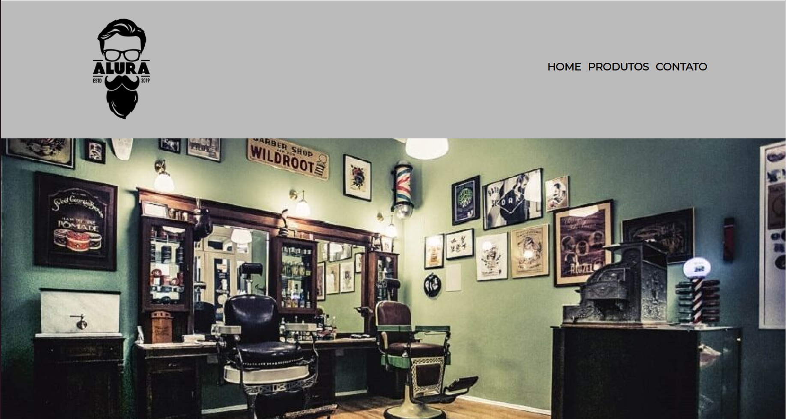
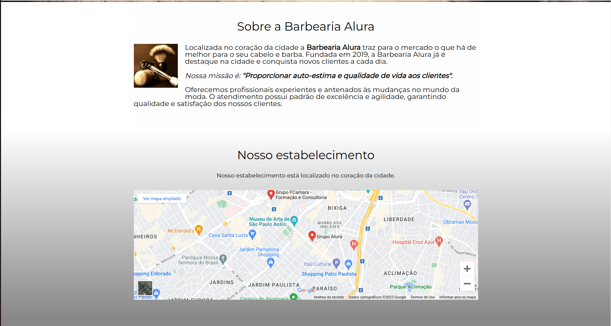
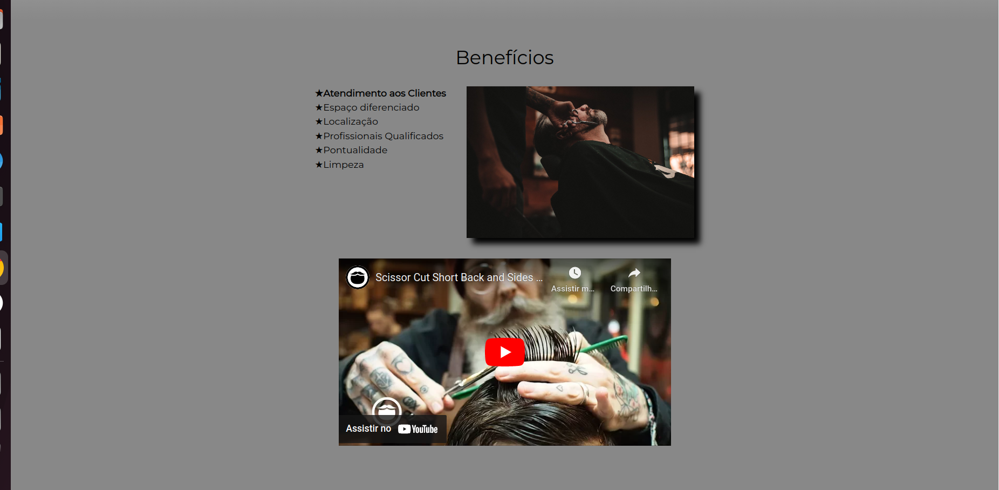
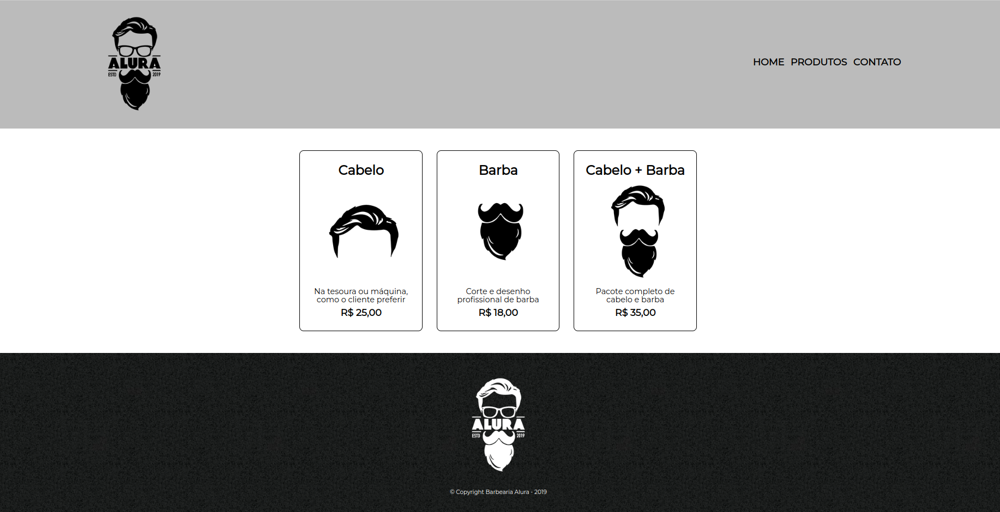
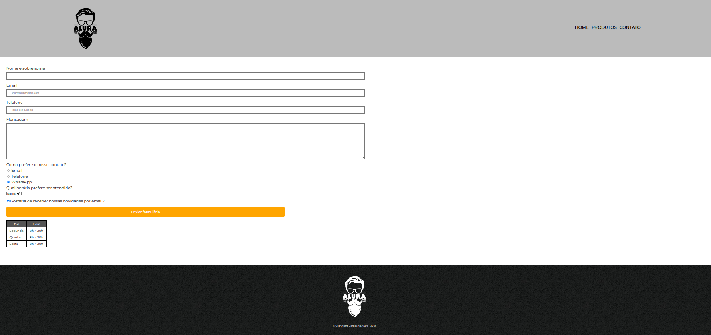

# Curso HTML & CSS - Alura ⭐

Neste projeto aprimorei minhas habilidades no HTML e CSS! 

Tive como base o curso da Alura, dividido em 4 partes, em que o foco era deselvolver uma página para a Barbearia Alura. 

O layout com o resultado final pode ser visto a seguir!

## Layout

Home Page - Header           |         Home Page - Main Section            |   
:-------------------------:|:-------------------------:|
  |  |

Home Page - Main Section           |         Home Page - Footer           |   
:-------------------------:|:-------------------------:|
  |  |

Products Page           |        Contact Page           |   
:-------------------------:|:-------------------------:|
  |  |

## Link para Deploy

[Barbearia Alura](https://html-css-alura-553a.vercel.app/) 

## Certificado

Certificado            |         
:-------------------------:|
  |

## Habilidades Desenvolvidas

 - Ultilizar TAGS semânticas e bem estruturadas em HTML;
 - Estruturar o layout da página e implementar destaques visuais, como fontes e tamanhos no CSS ;

 
 ## Referências
[HTML Element Reference](https://www.w3schools.com/TAGS/default.asp) 
[CSS Reference](https://www.w3schools.com/cssref/index.php) 
[HTML & CSS](https://cursos.alura.com.br/formacao-html-e-css) 
